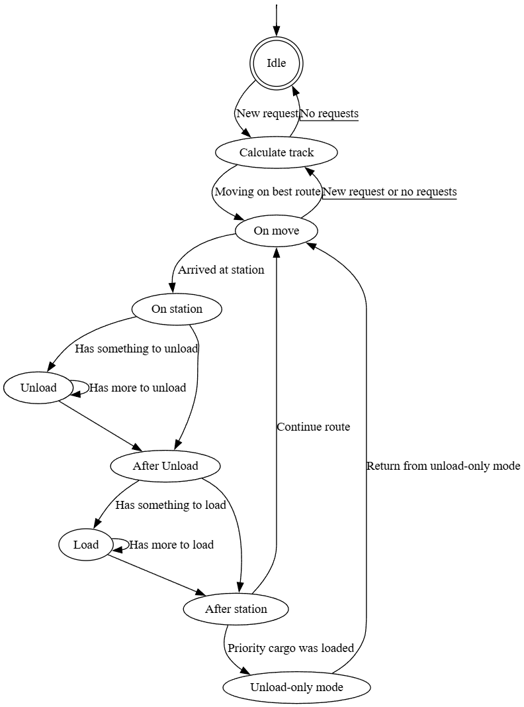
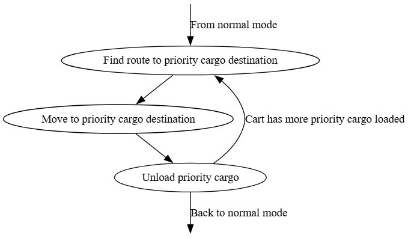

# Dokumentácia testov

## Diagramy chovania
Pre zaznamenanie chovania vozíku som sa rozhodol pre 2 rôzne diagramy chovania. Jeden pre normálny mód a druhý pre mód iba výkladky. Dizajn je podobný stavovým diagramom s tým, že vstupný stav je stav do ktorého mieri šípka zo žiadneho stavu a koncový stav je znázornený ako dvojkruh. V určitých prípadoch, kedy sa mi to zdalo potrebné, som použil podčiarknutie na zvýraznenie popisu hrany. Popisky ktoré sú zvýraznené patria ku hranám ktoré smerujú z dolného stavu do horného.

### Diagram chovania normálneho módu

V nasledujúcej tabuľke sú opísané jednotlivé stavy spoločne so skratkou pre lepšiu priehladnosť pri zápise testovacích ciest.

| Stav | Skratka | Popis |
| :---: | :-----: | ----- |
| `Idle` | `I` | Vozík nemá žiadne requesty |
| `Calculate track` | `CT` | Vozík vyhodnocuje ideálnu cestu |
| `On move` | `OM` | Vozík je na ceste na inú stanicu |
| `On station` | `OS` | Vozík prišiel na stanicu |
| `Unload` | `U` | Vozík vykladá tovar |
| `After Unload` | `AU` | Vozík vyložil všetok tovar na aktuálnej stanici |
| `Load` | `L` | Vozík nakladá tovar |
| `After Station` | `AS` | Vozík vykonal všetky požadované akcie na aktuálnej stanici |
| `Unload-only mode` | `UOM` | Stav obsahujúci celý diagram chovania vozíka v inom móde |

### Diagram chovania v móde iba výkladky

Tento diagram je pomerne jednoduchší ako diagram pre normány mód. To je spôsobené aj jednoduchším chovaním vozíka v tomto móde ako aj kontextom, kedy je sa vozík do tohto módu dostane. Diagram nahrádza stav `UOM` v normálnom móde a je priamo prepojený s ostatnými stavmi podľa diagramu normálneho módu.

| Stav | Skratka | Popis |
| :---: | :-----: | ----- |
| `Find route to priority cargo destination` | `UO-FR` | Vozík hladá cestu do destinácie pre prioritný náklad |
| `Move to priority cargo destination` | `UO-M` | Vozík sa presúva do destinácie pre prioritný náklad |
| `Unload priority cargo` | `UO-U` | Vozík vykladá prioritný náklad |

## Identifikácia testovacích ciest

Pri testovacích cestách som sa rozhodol použiť kritérium pokritia NC (Node-Coverage). Od pokrytia EC (Edge-Coverage) zostávajú neprejdené dve hrany. Prvá hrana je pri nakladaní viacerých nákladov na jednej stanici a druhá je v prípade že na vozíku je naloženého viac prioritného nákladu. Niektoré testovacie cesty môžu zahrňovať aj iné požiadavky, ktoré niesú zapísané v tabuľke. Do tabuľky zapisujem len požiadavky, podľa ktorých som cestu dizajnoval a ktoré aktívne kontrolujem pri vykonaní cesty.

| Názov | Cesta/Uzly | Pokryté požiadavky |
| :---: | :--------: | :----------------: |
| `Normal_Cargo` | `I CT OM OS U AU L AS` | `F-01 F-02 F-08 F-09 P-01 P-03`|
| `Prio_Cargo` | `I CT OM OS U AU L AS UO-FR UO-M UO-U` | `F-03 F-04 F-05 F-06 F-07 F-10 P-02 P-04 P-05` |
| `Operational` | `I CT OM OS U AU L AS` | `C-05 C-06` |

## Identifikácia vstupných parametrov

| Názov | Popis |
| :---: | :---- |
| `N_Carts` | (Int) Počet vozíkov v teste |
| `Max_Slots_On_Cart` | (Int) Maximálny počet slotov na vozíku |
| `Max_Weight_On_Cart` | (Int) Maximálny váha nákladu na vozíku |
| `N_Cargo` | (Int) Celkový počet nákladu v teste |
| `N_Normal_Requests` | (Int) Počet požiadavkov, ktoré budú vyriešené v normánom čase |
| `N_Prio_Requests` | (Int) Počet požiadavkov, ktoré sa nestihnú vyriešiť v normálnom čase a zmení sa im stav na prioritný  |
| `Sum_Cargo_weight` | (Int) Suma všetkých váh nákladu |
| `Max_Cargo_weight` | (Int) Maximálna hodnota váhy nákladu |
| `Max_Requests_Same_Time` | (Int) Maximálny počet požiadovkov, ktoré sa budú naraz riešiť|
| `Will_Adjust_Route` | (Bool) Upraví vozík počas jazdy trasu ? |
| `Will_Skip_Cargo_Capacity` | (Bool) Nenaloží vozík náklad kvôli nedostatočnej kapacite (Počet slotov alebo váha nákladu) |
| `Will_Skip_Cargo_UO_Mode` | (Bool) Nenaloží vozík náklad kvôli tomu že sa nachádza v režime iba výkladka |
| `N_Dead_Cargo` | (Int) Počet požiadavkov ktoré nevie vozík vyriešiť (Neskorý čas alebo váha presahujúca kapacitu) |

## Tabuľka testov

| Názov testu | `N_Carts` | `Max_Slots_On_Cart` | `Max_Weight_On_Cart` | `N_Cargo` |`N_Normal_Requests` | `N_Prio_Requests` | `Sum_Cargo_weight` | `Max_Cargo_weight` |`Max_Requests_Same_Time` | `Will_Adjust_Route` | `Will_Skip_Cargo_Capacity` | `Will_Skip_Cargo_UO_Mode` | `N_Dead_Cargo` | Očakávaný výsledok | Pokryté cesty | Názov a výskyt testovacej metódy |
| :---: | :---: | :---: | :---: | :---: | :---: | :---: | :---: | :---: | :---: | :---: | :---: | :---: | :---: | :---: | :---: | :---: |
| `test_normal_mode` | 1 | 2 | 150 | 2 | 2 | 0 | 40 | 20 | 2 | `True` | `False` | `False` | 0 | `Ok` | `Normal_Cargo` | `test_cartctl/test_normal_mode` |
| `test_unload_only_mode` | 1 | 2 | 150 | 4 | 3 | 1 | 105 | 50 | 3 | `False` | `True` | `True` | 0 | `Ok` | `Prio_Cargo` | `test_cartctl/test_unload_only_mode` |
| `test_operational` | 1 | 2 | 150 | 2 | 1 | 0 | 220 | 200 | 2 | `False` | `True` | `False` | 1 | `Ok` | `Operational` | `test_cartctl/test_operational` |

### Popis testov

`test_normal_mode` - Zoberie prvý náklad z A do D a začne cestovať. Počas cesty dostane nový request, vráti sa do A a zoberie nový náklad z A do D. Oba náklady odvezie do D a naraz vyloží.

`test_unload_only_mode` - Vozík zoberie 2 náklady z A do D (postupuje ako v predchádzajúcom teste), následne preskočí náklad na C do B, pretože je plný. Kým sa k nemu vráti tak náklad sa stane prioritný. Počas toho ako je v režime iba výkladka preskočí nový náklad na A do C. Po vyriešení prioritného nákladu vyrieši poslednú požiadavku.

`test_operational` - Skladá sa len z dvoch nákladov. Jeden z nich má vyššiu váhu ako je celková povolená váha na vozíku. Tento náklad vozík ignoruje a odvezie len náklad ktorý má hodnotu v súlade s operačnými vlastnosťami vozíka.